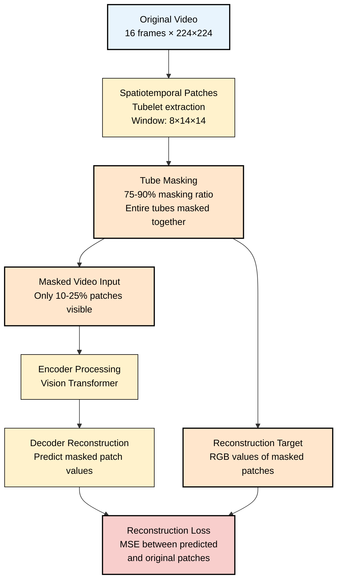

# VideoMAE UCF-101 Classification Pipeline - Mermaid Diagram

## Complete Architecture Flow

```mermaid
graph TD
    %% Input Stage
    A[UCF-101 Video<br/>16 frames × 224×224×3] --> B[Video Loading<br/>Decord VideoReader<br/>Frame Sampling rate=4]
    
    %% Preprocessing Stage
    B --> C[Data Augmentation<br/>GroupMultiScaleCrop<br/>Stack & ToTensor<br/>Normalize]
    B --> D[Tube Masking<br/>TubeMaskingGenerator<br/>Mask Ratio: 75%<br/>Window: 8×14×14]
    
    %% Patch Embedding
    C --> E[Patch Embedding<br/>3D Conv tubelet_size=2<br/>Kernel: 2×16×16<br/>Output: 768-dim tokens]
    D --> E
    
    %% Positional Embedding
    E --> F[Positional Embedding<br/>Sinusoidal/Learnable<br/>Shape: 1×1568×768]
    
    %% Vision Transformer
    F --> G[Vision Transformer Encoder<br/>ViT-Base: 12 Layers × 12 Heads × 768D]
    
    %% Transformer Details
    G --> H[Multi-Head Attention<br/>12 heads × 64 dim/head<br/>Q,K,V ∈ ℝ^1568×768]
    H --> I[Add & Norm<br/>Residual + LayerNorm]
    I --> J[Feed Forward Network<br/>768→3072→768<br/>GELU activation]
    J --> K[Add & Norm<br/>Residual + LayerNorm]
    
    %% Loop back for 12 layers
    K -.-> H
    
    %% Classification Head
    K --> L[Feature Aggregation<br/>Mean Pooling or<br/>CLS Token Selection]
    L --> M[Layer Norm & Dropout<br/>p=0.5]
    M --> N[Classification Head<br/>Linear: 768 → 101<br/>UCF-101 Classes]
    
    %% Output
    N --> O[Softmax<br/>Class Probabilities<br/>101 Action Classes]
    
    %% Training Components
    O --> P[Cross Entropy Loss<br/>+ Label Smoothing]
    P --> Q[AdamW Optimizer<br/>lr=5e-4, Weight Decay=0.05<br/>Cosine LR Schedule]
    
    %% Evaluation
    O --> R[Evaluation Metrics<br/>Top-1 & Top-5 Accuracy<br/>Confusion Matrix<br/>Per-class F1 Score]
    
    %% Styling
    classDef inputStyle fill:#E8F4FD,stroke:#000,stroke-width:2px,color:#000
    classDef preprocessStyle fill:#FFF2CC,stroke:#000,stroke-width:1px,color:#000
    classDef backboneStyle fill:#E1D5E7,stroke:#000,stroke-width:2px,color:#000
    classDef attentionStyle fill:#D5E8D4,stroke:#000,stroke-width:1px,color:#000
    classDef classificationStyle fill:#FFE6CC,stroke:#000,stroke-width:2px,color:#000
    classDef outputStyle fill:#F8CECC,stroke:#000,stroke-width:2px,color:#000
    classDef trainingStyle fill:#F0F0F0,stroke:#000,stroke-width:1px,color:#000
    
    class A inputStyle
    class B,C,D preprocessStyle
    class E,F,G backboneStyle
    class H,I,J,K attentionStyle
    class L,M,N classificationStyle
    class O outputStyle
    class P,Q,R trainingStyle
```



## Detailed Attention Mechanism

```mermaid
graph LR
    A[Input Tokens<br/>X ∈ ℝ^1568×768] --> B[Linear Projection Q<br/>Q = XW_Q]
    A --> C[Linear Projection K<br/>K = XW_K]
    A --> D[Linear Projection V<br/>V = XW_V]
    
    B --> E[Split into 12 heads<br/>768 = 12 × 64]
    C --> E
    D --> E
    
    E --> F[Multi-Head Attention<br/>Attention = softmax(QK^T/√64)V<br/>for each head in parallel]
    
    F --> G[Concatenate heads<br/>Concat(head₁,...,head₁₂)]
    
    G --> H[Output Projection<br/>MultiHead(Q,K,V) = Concat(heads)W_O]
    
    H --> I[Output<br/>ℝ^1568×768]
    
    classDef inputStyle fill:#E8F4FD,stroke:#000,stroke-width:2px,color:#000
    classDef projectionStyle fill:#FFE6CC,stroke:#000,stroke-width:1px,color:#000
    classDef attentionStyle fill:#D5E8D4,stroke:#000,stroke-width:2px,color:#000
    classDef outputStyle fill:#F8CECC,stroke:#000,stroke-width:2px,color:#000
    
    class A,I inputStyle
    class B,C,D,G,H projectionStyle
    class E,F attentionStyle
```

## Tube Masking Strategy



## Model Specifications

| Component | Specification |
|-----------|--------------|
| **Model Size** | ViT-Base: ~86M parameters |
| **Input** | 16 frames × 224×224×3 |
| **Patch Size** | 16×16 spatial, tubelet_size=2 temporal |
| **Sequence Length** | 1568 tokens (8×14×14) |
| **Embedding Dim** | 768 |
| **Transformer** | 12 layers × 12 heads |
| **Classes** | 101 (UCF-101 actions) |
| **Masking Ratio** | 75% for fine-tuning, 90% for pre-training |

## Training Configuration

| Parameter | Value |
|-----------|-------|
| **Optimizer** | AdamW |
| **Learning Rate** | 5e-4 |
| **Weight Decay** | 0.05 |
| **LR Schedule** | Cosine annealing |
| **Batch Size** | 16 (across 8 GPUs) |
| **Epochs** | 100 for fine-tuning |
| **Warmup** | 5 epochs |
| **Precision** | Mixed (FP16) |

## Performance Metrics

| Metric | UCF-101 Performance |
|--------|-------------------|
| **Top-1 Accuracy** | ~91.3% |
| **Top-5 Accuracy** | ~99.4% |
| **Inference Time** | ~50ms |
| **Model Size** | ~340MB |

## Dataset Information

- **UCF-101**: 101 action classes
- **Videos**: ~13,320 total
- **Frame Rate**: 25 fps, variable length
- **Validation**: 3-fold cross-validation
- **Preprocessing**: Center crop, normalization
- **Augmentation**: Multi-scale crop, random horizontal flip

## Key Features

1. **Tube Masking**: Spatiotemporal consistency with high masking ratio
2. **Self-Supervised Pre-training**: Learns strong video representations
3. **ViT Backbone**: Plain Vision Transformer adapted for video
4. **Efficient Training**: 3.2x speedup compared to contrastive methods
5. **Strong Performance**: State-of-the-art results on multiple benchmarks
